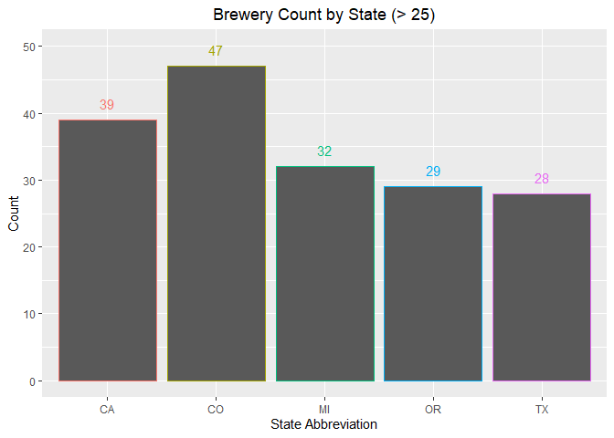
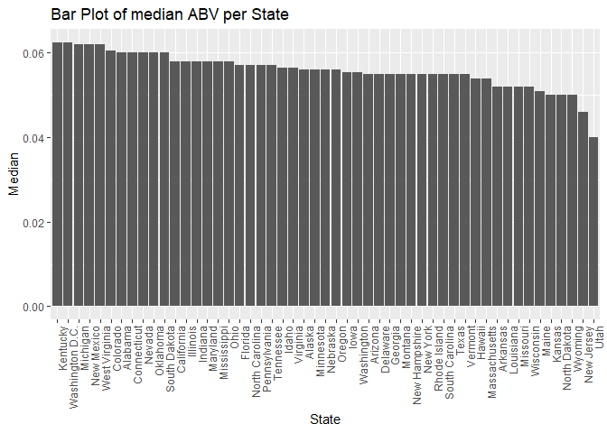
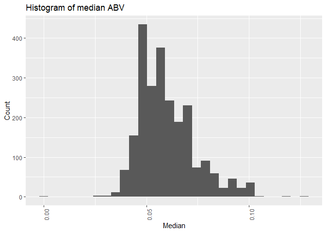

Exploratory Data Analysis
================
Chance Robinson
10/12/2019

  - [Exploratory Data Analysis](#exploratory-data-analysis)
      - [Library Imports](#library-imports)
      - [Load the csv data](#load-the-csv-data)
      - [Default Output](#default-output)
          - [Beers](#beers)
          - [Breweries](#breweries)
      - [Clone data sets](#clone-data-sets)
          - [Beers](#beers-1)
          - [Breweries](#breweries-1)
      - [State Lookup](#state-lookup)
      - [Brewery Count by State](#brewery-count-by-state)
      - [Merge beer and breweries](#merge-beer-and-breweries)
          - [First 6 observations of merged data
            sets](#first-6-observations-of-merged-data-sets)
          - [Last 6 observations of merged data
            sets](#last-6-observations-of-merged-data-sets)
      - [Missing Values](#missing-values)
      - [Barplot of median values](#barplot-of-median-values)
          - [ABV](#abv)
          - [IBU](#ibu)
      - [Highest Median Values](#highest-median-values)
          - [ABV](#abv-1)
          - [IBU](#ibu-1)
      - [ABV Summaary](#abv-summaary)
          - [Histogram](#histogram)
          - [Summary Statistics](#summary-statistics)
      - [ABV vs IBU](#abv-vs-ibu)
          - [Scatterplot](#scatterplot)
          - [Pearson’s Correlation](#pearsons-correlation)
          - [Correlation Test](#correlation-test)
      - [KNN](#knn)
      - [Headmap of US Craft Beers by
        State](#headmap-of-us-craft-beers-by-state)

# Exploratory Data Analysis

## Library Imports

``` r
library(tidyverse)
```

    ## -- Attaching packages ----------------------------------------------------------------------------------------------------------------- tidyverse 1.2.1 --

    ## v ggplot2 3.2.0     v purrr   0.3.2
    ## v tibble  2.1.3     v dplyr   0.8.3
    ## v tidyr   0.8.3     v stringr 1.4.0
    ## v readr   1.3.1     v forcats 0.4.0

    ## -- Conflicts -------------------------------------------------------------------------------------------------------------------- tidyverse_conflicts() --
    ## x dplyr::filter() masks stats::filter()
    ## x dplyr::lag()    masks stats::lag()

``` r
library(knitr)
library(kableExtra)
```

    ## 
    ## Attaching package: 'kableExtra'

    ## The following object is masked from 'package:dplyr':
    ## 
    ##     group_rows

## Load the csv data

``` r
beers <- read.csv("../../../data/Beers.csv", stringsAsFactors=FALSE)
breweries <- read.csv("../../../data/Breweries.csv", stringsAsFactors=FALSE)
```

## Default Output

### Beers

``` r
head(beers)
```

    ##                  Name Beer_ID   ABV IBU Brewery_id
    ## 1            Pub Beer    1436 0.050  NA        409
    ## 2         Devil's Cup    2265 0.066  NA        178
    ## 3 Rise of the Phoenix    2264 0.071  NA        178
    ## 4            Sinister    2263 0.090  NA        178
    ## 5       Sex and Candy    2262 0.075  NA        178
    ## 6        Black Exodus    2261 0.077  NA        178
    ##                            Style Ounces
    ## 1            American Pale Lager     12
    ## 2        American Pale Ale (APA)     12
    ## 3                   American IPA     12
    ## 4 American Double / Imperial IPA     12
    ## 5                   American IPA     12
    ## 6                  Oatmeal Stout     12

``` r
# summary(beers)
# str(beers)
```

#### Data Dictionary

| Column Name     | Type      | Description                      |
| --------------- | --------- | -------------------------------- |
| 1\. Name        | Character | Beer name                        |
| 2\. Beer\_ID    | Integer   | Unique identifier for beer       |
| 3\. ABV         | Double    | Alcohol by volume                |
| 4\. IBU         | Integer   | International Bitterness Units   |
| 5\. Brewery\_id | Integer   | Foreign key for brewery data set |
| 6\. Style       | Character | Beer type                        |
| 7\. Ounces      | Double    | Number of ounces per serving     |

### Breweries

``` r
head(breweries)
```

    ##   Brew_ID                      Name          City State
    ## 1       1        NorthGate Brewing    Minneapolis    MN
    ## 2       2 Against the Grain Brewery    Louisville    KY
    ## 3       3  Jack's Abby Craft Lagers    Framingham    MA
    ## 4       4 Mike Hess Brewing Company     San Diego    CA
    ## 5       5   Fort Point Beer Company San Francisco    CA
    ## 6       6     COAST Brewing Company    Charleston    SC

``` r
# summary(breweries)
# str(breweries)
```

#### Data Dictionary

| Column Name  | Type      | Description                   |
| ------------ | --------- | ----------------------------- |
| 1\. Brew\_ID | Integer   | Unique identifier for brewery |
| 2\. Name     | Integer   | Brewery name                  |
| 3\. City     | Character | City of brewery               |
| 4\. State    | Character | State of brewery              |

## Clone data sets

  - Create a pristine copy of the originals so that further refinements
    of the columns names, values, etc.. can be performed

### Beers

``` r
df_beers <- beers
colnames(df_beers)
```

    ## [1] "Name"       "Beer_ID"    "ABV"        "IBU"        "Brewery_id"
    ## [6] "Style"      "Ounces"

``` r
names(df_beers) <- c("beer.name", "beer.id", "beer.abv", "beer.ibu", "beer.brewery.id", "beer.style", "beer.ounces")
head(df_beers)
```

    ##             beer.name beer.id beer.abv beer.ibu beer.brewery.id
    ## 1            Pub Beer    1436    0.050       NA             409
    ## 2         Devil's Cup    2265    0.066       NA             178
    ## 3 Rise of the Phoenix    2264    0.071       NA             178
    ## 4            Sinister    2263    0.090       NA             178
    ## 5       Sex and Candy    2262    0.075       NA             178
    ## 6        Black Exodus    2261    0.077       NA             178
    ##                       beer.style beer.ounces
    ## 1            American Pale Lager          12
    ## 2        American Pale Ale (APA)          12
    ## 3                   American IPA          12
    ## 4 American Double / Imperial IPA          12
    ## 5                   American IPA          12
    ## 6                  Oatmeal Stout          12

### Breweries

``` r
df_breweries <- breweries
colnames(df_breweries)
```

    ## [1] "Brew_ID" "Name"    "City"    "State"

``` r
names(df_breweries) <- c("brewery.id", "brewery.name", "brewery.city", "brewery.state.abb")

# The state column has an extra white space at the end of the string
df_breweries <- df_breweries %>%
  mutate(brewery.state.abb = trimws(brewery.state.abb))

head(df_breweries)
```

    ##   brewery.id              brewery.name  brewery.city brewery.state.abb
    ## 1          1        NorthGate Brewing    Minneapolis                MN
    ## 2          2 Against the Grain Brewery    Louisville                KY
    ## 3          3  Jack's Abby Craft Lagers    Framingham                MA
    ## 4          4 Mike Hess Brewing Company     San Diego                CA
    ## 5          5   Fort Point Beer Company San Francisco                CA
    ## 6          6     COAST Brewing Company    Charleston                SC

## State Lookup

  - Washington D.C. added as an entry

<!-- end list -->

``` r
#makes a data frame with State abbreviation, name  and region
df_state_lookup = data.frame(state.abb, state.name, state.region, stringsAsFactors=FALSE) 
# df_state_lookup

# add the District of Columbia as a lookup value
df_state_lookup <- rbind(df_state_lookup, 'DC' = c("DC", "Washington D.C.", "South"))
head(df_state_lookup)
```

    ##   state.abb state.name state.region
    ## 1        AL    Alabama        South
    ## 2        AK     Alaska         West
    ## 3        AZ    Arizona         West
    ## 4        AR   Arkansas        South
    ## 5        CA California         West
    ## 6        CO   Colorado         West

## Brewery Count by State

1.  How many breweries are present in each state?

<!-- end list -->

  - Note that all 50 states have counts and that the District of
    Columbia is also included to make a total of
51

<!-- end list -->

``` r
df_breweries_state <- merge(df_breweries, df_state_lookup, by.x = "brewery.state.abb", by.y = "state.abb", all.x = TRUE)
# df_breweries_state

df_breweries_count_by_state <- df_breweries_state %>%
  count(state.name, sort = TRUE)

head(df_breweries_count_by_state)
```

    ## # A tibble: 6 x 2
    ##   state.name       n
    ##   <chr>        <int>
    ## 1 Colorado        47
    ## 2 California      39
    ## 3 Michigan        32
    ## 4 Oregon          29
    ## 5 Texas           28
    ## 6 Pennsylvania    25

``` r
# kable(df_breweries_count_by_state) %>%
#   kable_styling(bootstrap_options = c("striped", "hover", "condensed", "responsive"))


df_breweries_state %>%
  group_by(brewery.state.abb) %>%
  filter(n() > 25) %>%
  ggplot(aes(x = brewery.state.abb, color=brewery.state.abb)) + 
  geom_bar() +
  geom_text(stat='count', aes(label=..count..), vjust=-1) +
  ggtitle("Brewery Count by State (> 25)") +
  labs(x = "State Abbreviation", y = "Count") +
  theme(plot.title = element_text(hjust = 0.5)) + lims(y=c(0,50)) +
  # guides(fill=guide_legend(title=NULL)) 
  theme(legend.position = "none")
```

<!-- -->

``` r
df_breweries_state %>%
  group_by(brewery.state.abb) %>%
  filter(n() < 5) %>%
  ggplot(aes(x = brewery.state.abb, color=brewery.state.abb)) + 
  geom_bar() +
  geom_text(stat='count', aes(label=..count..), vjust=-1) +
  ggtitle("Brewery Count by State (< 5)") +
  labs(x = "State Abbreviation", y = "Count") +
  theme(plot.title = element_text(hjust = 0.5)) + lims(y=c(0,5)) +
  # guides(fill=guide_legend(title=NULL)) 
  theme(legend.position = "none")
```

<!-- -->

``` r
df_merged <- merge(df_beers, df_breweries_state, by.x = "beer.brewery.id", by.y = "brewery.id")
# df_merged
```

## Merge beer and breweries

2.  Merge beer data with the breweries data. Print the first 6
    observations and the last six observations to check the merged file.
    (RMD only, this does not need to be included in the presentation or
    the deck.)

### First 6 observations of merged data sets

``` r
head(df_merged)
```

    ##   beer.brewery.id     beer.name beer.id beer.abv beer.ibu
    ## 1               1  Get Together    2692    0.045       50
    ## 2               1 Maggie's Leap    2691    0.049       26
    ## 3               1    Wall's End    2690    0.048       19
    ## 4               1       Pumpion    2689    0.060       38
    ## 5               1    Stronghold    2688    0.060       25
    ## 6               1   Parapet ESB    2687    0.056       47
    ##                            beer.style beer.ounces brewery.state.abb
    ## 1                        American IPA          16                MN
    ## 2                  Milk / Sweet Stout          16                MN
    ## 3                   English Brown Ale          16                MN
    ## 4                         Pumpkin Ale          16                MN
    ## 5                     American Porter          16                MN
    ## 6 Extra Special / Strong Bitter (ESB)          16                MN
    ##         brewery.name brewery.city state.name  state.region
    ## 1 NorthGate Brewing   Minneapolis  Minnesota North Central
    ## 2 NorthGate Brewing   Minneapolis  Minnesota North Central
    ## 3 NorthGate Brewing   Minneapolis  Minnesota North Central
    ## 4 NorthGate Brewing   Minneapolis  Minnesota North Central
    ## 5 NorthGate Brewing   Minneapolis  Minnesota North Central
    ## 6 NorthGate Brewing   Minneapolis  Minnesota North Central

### Last 6 observations of merged data sets

``` r
tail(df_merged)
```

    ##      beer.brewery.id                 beer.name beer.id beer.abv beer.ibu
    ## 2405             556             Pilsner Ukiah      98    0.055       NA
    ## 2406             557  Heinnieweisse Weissebier      52    0.049       NA
    ## 2407             557           Snapperhead IPA      51    0.068       NA
    ## 2408             557         Moo Thunder Stout      50    0.049       NA
    ## 2409             557         Porkslap Pale Ale      49    0.043       NA
    ## 2410             558 Urban Wilderness Pale Ale      30    0.049       NA
    ##                   beer.style beer.ounces brewery.state.abb
    ## 2405         German Pilsener          12                CA
    ## 2406              Hefeweizen          12                NY
    ## 2407            American IPA          12                NY
    ## 2408      Milk / Sweet Stout          12                NY
    ## 2409 American Pale Ale (APA)          12                NY
    ## 2410        English Pale Ale          12                AK
    ##                       brewery.name  brewery.city state.name state.region
    ## 2405         Ukiah Brewing Company         Ukiah California         West
    ## 2406       Butternuts Beer and Ale Garrattsville   New York    Northeast
    ## 2407       Butternuts Beer and Ale Garrattsville   New York    Northeast
    ## 2408       Butternuts Beer and Ale Garrattsville   New York    Northeast
    ## 2409       Butternuts Beer and Ale Garrattsville   New York    Northeast
    ## 2410 Sleeping Lady Brewing Company     Anchorage     Alaska         West

## Missing Values

3.  Address the missing values in each column.

<!-- end list -->

  - The ABV and IBU columns have NA values

  - The Style column as blank values

  - 62 for ABV

  - 1005 for IBU (this is a very high percentage of the overall rows)

<!-- end list -->

``` r
df_has_na_values <- any(is.na(df_merged))
df_has_na_values
```

    ## [1] TRUE

``` r
# which columns have missing values
df_na_columns = which(colSums(is.na(df_merged)) > 0)
df_na_columns
```

    ## beer.abv beer.ibu 
    ##        4        5

``` r
df_na_abv <- df_merged %>%
  filter(is.na(beer.abv))

na_abv_count <- dim(df_na_abv)[1]

df_na_ibu <- df_merged %>%
  filter(is.na(beer.ibu))

na_ibu_count <- dim(df_na_ibu)[1]


allmisscols <- sapply(df_merged, function(x) any(x == '' ))

# allmisscols

df_na_style <- df_merged %>%
  filter(beer.style=='')

na_style_count <- dim(df_na_style)[1]


total_count <- dim(df_merged)[1]
```

| Column Name | Count | % Missing  |
| ----------- | ----- | ---------- |
| 1\. ABV     | 62    | 2.5726141  |
| 2\. IBU     | 1005  | 41.7012448 |
| 3\. Style   | 5     | 0.2074689  |

## Barplot of median values

4.  Compute the median alcohol content and international bitterness unit
    for each state. Plot a bar chart to compare.

### ABV

``` r
# df_merged_abv_clean <- df_merged %>%
#   filter(!is.na(beer.abv)) %>%
#   group_by(state.name) %>%
#   summarize(beers.abv.median = median(beer.abv), count = n()) %>%
#   arrange(desc(beers.abv.median))

# head(df_merged_abv_clean)

# df_merged_abv_clean %>%
#   ggplot(aes(x = reorder(state.name, -beers.abv.median), y=as.numeric(beers.abv.median))) +
#   geom_bar(stat = "identity", position = "dodge") +
#   ggtitle("Bar Plot of median ABV per State") +
#   labs(x = "State", y = "Median") +
#   theme(axis.text.x = element_text(angle = 90, hjust = 1))

df_merged %>%
  select(state.name, beer.abv) %>%
  remove_missing(na.rm = TRUE) %>%
  group_by(state.name) %>%
  mutate(beers.abv.median = median(beer.abv)) %>%
  ggplot(aes(x = reorder(state.name, -beers.abv.median), y=beers.abv.median)) +
  geom_bar(stat = "identity", position = "dodge") +
  ggtitle("Bar Plot of median ABV per State") +
  labs(x = "State", y = "Median") +
  theme(axis.text.x = element_text(angle = 90, hjust = 1))
```

<!-- -->

### IBU

``` r
# df_merged_ibu_clean <- df_merged %>%
#   filter(!is.na(beer.ibu)) %>%
#   group_by(state.name) %>%
#   summarize(beers.ibu.median = median(beer.ibu), count = n()) %>%
#   arrange(desc(beers.ibu.median))

# head(df_merged_ibu_clean)

# df_merged_ibu_clean %>%
#   ggplot(aes(x = reorder(state.name, -beers.ibu.median), y=as.numeric(beers.ibu.median))) +
#   geom_bar(stat = "identity", position = "dodge") +
#   ggtitle("Bar Plot of median IBU per State") +
#   labs(x = "State", y = "Median") +
#   theme(axis.text.x = element_text(angle = 90, hjust = 1))


df_merged %>%
  select(state.name, beer.ibu) %>%
  remove_missing(na.rm = TRUE) %>%
  group_by(state.name) %>%
  mutate(beers.ibu.median = median(beer.ibu)) %>%
  ggplot(aes(x = reorder(state.name, -beers.ibu.median), y=beers.ibu.median)) +
  geom_bar(stat = "identity", position = "dodge") +
  ggtitle("Bar Plot of median IBU per State") +
  labs(x = "State", y = "Median") +
  theme(axis.text.x = element_text(angle = 90, hjust = 1))
```

<!-- -->

## Highest Median Values

5.  Which state has the …

<!-- end list -->

  - maximum alcoholic (ABV) beer? Colorado
  - most bitter (IBU) beer? Oregon

### ABV

``` r
### Measures of Center
df_merged_abv_max <- df_merged %>%
  filter(!is.na(beer.abv)) %>%
  group_by(state.name) %>%
  summarize(beers.abv.max = max(beer.abv), count = n()) %>%
  arrange(desc(beers.abv.max))
  #top_n(10)

df_merged_abv_median <- df_merged %>%
  filter(!is.na(beer.abv)) %>%
  group_by(state.name) %>%
  summarize(beers.abv.median = median(beer.abv), count = n()) %>%
  arrange(desc(beers.abv.median))
  #top_n(10)

df_merged_abv_mean <- df_merged %>%
  filter(!is.na(beer.abv)) %>%
  group_by(state.name) %>%
  summarize(beers.abv.mean = mean(beer.abv), count = n()) %>%
  arrange(desc(beers.abv.mean))
  # top_n(10)

max_abv <- head(df_merged_abv_max, 1)
median_abv <- head(df_merged_abv_median, 2)
mean_abv <- head(df_merged_abv_mean,1)


head(df_merged_abv_max)
```

    ## # A tibble: 6 x 3
    ##   state.name beers.abv.max count
    ##   <chr>              <dbl> <int>
    ## 1 Colorado           0.128   250
    ## 2 Kentucky           0.125    20
    ## 3 Indiana            0.12    137
    ## 4 New York           0.1      73
    ## 5 California         0.099   182
    ## 6 Idaho              0.099    30

``` r
head(df_merged_abv_median)
```

    ## # A tibble: 6 x 3
    ##   state.name      beers.abv.median count
    ##   <chr>                      <dbl> <int>
    ## 1 Kentucky                  0.0625    20
    ## 2 Washington D.C.           0.0625     8
    ## 3 Michigan                  0.062    151
    ## 4 New Mexico                0.062     13
    ## 5 West Virginia             0.062      2
    ## 6 Colorado                  0.0605   250

``` r
head(df_merged_abv_mean)
```

    ## # A tibble: 6 x 3
    ##   state.name      beers.abv.mean count
    ##   <chr>                    <dbl> <int>
    ## 1 Nevada                  0.0669    10
    ## 2 Washington D.C.         0.0656     8
    ## 3 Kentucky                0.0646    20
    ## 4 Indiana                 0.0634   137
    ## 5 Michigan                0.0634   151
    ## 6 Colorado                0.0634   250

| Top ABV Statistics | State           | Value  |
| ------------------ | --------------- | ------ |
| 1\. Max            | Colorado        | 0.128  |
| 2\. Median         | Kentucky        | 0.0625 |
| 2\. Median         | Washington D.C. | 0.0625 |
| 3\. Mean           | Nevada          | 0.0669 |

### IBU

``` r
### Measures of Center
df_merged_ibu_max <- df_merged %>%
  filter(!is.na(beer.ibu)) %>%
  group_by(state.name) %>%
  summarize(beers.ibu.max = max(beer.ibu), count = n()) %>%
  arrange(desc(beers.ibu.max))
  #top_n(10)

df_merged_ibu_median <- df_merged %>%
  filter(!is.na(beer.ibu)) %>%
  group_by(state.name) %>%
  summarize(beers.ibu.median = median(beer.ibu), count = n()) %>%
  arrange(desc(beers.ibu.median))
  #top_n(10)

df_merged_ibu_mean <- df_merged %>%
  filter(!is.na(beer.ibu)) %>%
  group_by(state.name) %>%
  summarize(beers.ibu.mean = mean(beer.ibu), count = n()) %>%
  arrange(desc(beers.ibu.mean))
  #top_n(10)

max_ibu <- head(df_merged_ibu_max, 1)
median_ibu <- head(df_merged_ibu_median, 1)
mean_ibu <- head(df_merged_ibu_mean,1)

head(df_merged_ibu_max)
```

    ## # A tibble: 6 x 3
    ##   state.name    beers.ibu.max count
    ##   <chr>                 <int> <int>
    ## 1 Oregon                  138    87
    ## 2 Virginia                135    35
    ## 3 Massachusetts           130    51
    ## 4 Ohio                    126    32
    ## 5 Minnesota               120    46
    ## 6 Vermont                 120    17

``` r
head(df_merged_ibu_median)
```

    ## # A tibble: 6 x 3
    ##   state.name    beers.ibu.median count
    ##   <chr>                    <dbl> <int>
    ## 1 Maine                     61       7
    ## 2 West Virginia             57.5     2
    ## 3 Florida                   55      37
    ## 4 Georgia                   55       7
    ## 5 Delaware                  52       1
    ## 6 New Mexico                51       6

``` r
head(df_merged_ibu_mean)
```

    ## # A tibble: 6 x 3
    ##   state.name      beers.ibu.mean count
    ##   <chr>                    <dbl> <int>
    ## 1 West Virginia             57.5     2
    ## 2 New Mexico                57       6
    ## 3 Washington D.C.           55.2     4
    ## 4 Idaho                     55.1    17
    ## 5 Maine                     52.9     7
    ## 6 Delaware                  52       1

| Top IBU Statistics | State         | Value |
| ------------------ | ------------- | ----- |
| 1\. Max            | Oregon        | 138   |
| 2\. Median         | Maine         | 61    |
| 3\. Mean           | West Virginia | 57.5  |

## ABV Summaary

### Histogram

6.  Comment on the summary statistics and distribution of the ABV
    variable.

<!-- end list -->

  - The histogram is right-skewed with the majority of the beers falling
    between 0.05 and 0.067 % alcholol by volume.

<!-- end list -->

``` r
df_merged_abv_cleaned <- df_merged %>%
  select(state.name, beer.abv) %>%
  remove_missing(na.rm = TRUE)

summary(df_merged_abv_cleaned)
```

    ##   state.name           beer.abv      
    ##  Length:2348        Min.   :0.00100  
    ##  Class :character   1st Qu.:0.05000  
    ##  Mode  :character   Median :0.05600  
    ##                     Mean   :0.05977  
    ##                     3rd Qu.:0.06700  
    ##                     Max.   :0.12800

``` r
abv_min <- min(df_merged_abv_cleaned$beer.abv)
abv_max <- max(df_merged_abv_cleaned$beer.abv)
abv_median <- median(df_merged_abv_cleaned$beer.abv)
abv_mean <- mean(df_merged_abv_cleaned$beer.abv)
abv_sd <- sd(df_merged_abv_cleaned$beer.abv)


df_merged_abv_cleaned %>%
  ggplot(aes(beer.abv)) +
  geom_histogram() +
  ggtitle("Histogram of median ABV") +
  labs(x = "Median", y = "Count") +
  theme(axis.text.x = element_text(angle = 90, hjust = 1))
```

    ## `stat_bin()` using `bins = 30`. Pick better value with `binwidth`.

<!-- -->

### Summary Statistics

| ABV Summary Statistic  | Value     |
| ---------------------- | --------- |
| 1\. Minimum            | 0.001     |
| 2\. Maxiumum           | 0.128     |
| 3\. Median             | 0.056     |
| 4\. Mean               | 0.0597734 |
| 5\. Standard Deviation | 0.0135417 |

``` r
abv_min 
```

    ## [1] 0.001

``` r
abv_max 
```

    ## [1] 0.128

``` r
abv_median 
```

    ## [1] 0.056

``` r
abv_mean 
```

    ## [1] 0.05977342

``` r
abv_sd 
```

    ## [1] 0.01354173

## ABV vs IBU

7.  Is there an apparent relationship between the bitterness of the beer
    and its alcoholic content? Draw a scatter plot. Make your best
    judgment of a relationship and EXPLAIN your answer.

<!-- end list -->

  - There appears to be a linear relationship between a beer’s
    International Bitterness Units (IBU) and the Alcohol by volume
    (ABV). The stronger a beer is, the more likely it is to rate higher
    on the bitterness scale.

### Scatterplot

``` r
df_merged %>%
  select(beer.abv, beer.ibu) %>%
  remove_missing(na.rm = TRUE) %>%
  ggplot(aes(x = beer.abv, y = beer.ibu)) + 
  ggtitle("Scatterplot of IBU by ABV") +
  geom_point(alpha = 0.3) + 
  labs(x = "ABV", y = "IBU") +
  # scale_x_continuous(breaks = seq(from = 0, to = 45, by = 2)) + 
  geom_smooth(method = 'lm')
```

<!-- -->

``` r
df_abv_ibu_cor <- df_merged %>%
  select(beer.abv, beer.ibu)
```

### Pearson’s Correlation

``` r
r <- cor(as.matrix(df_abv_ibu_cor), use="complete.obs")
r
```

    ##           beer.abv  beer.ibu
    ## beer.abv 1.0000000 0.6706215
    ## beer.ibu 0.6706215 1.0000000

### Correlation Test

``` r
t <- cor.test(df_abv_ibu_cor$beer.abv, df_abv_ibu_cor$beer.ibu, use="complete.obs")
t
```

    ## 
    ##  Pearson's product-moment correlation
    ## 
    ## data:  df_abv_ibu_cor$beer.abv and df_abv_ibu_cor$beer.ibu
    ## t = 33.863, df = 1403, p-value < 2.2e-16
    ## alternative hypothesis: true correlation is not equal to 0
    ## 95 percent confidence interval:
    ##  0.6407982 0.6984238
    ## sample estimates:
    ##       cor 
    ## 0.6706215

``` r
# t$estimate
```

## KNN

7.  Budweiser would also like to investigate the difference with respect
    to IBU and ABV between IPAs (India Pale Ales) and other types of Ale
    (any beer with “Ale” in its name other than IPA). You decide to use
    KNN clustering to investigate this relationship. Provide statistical
    evidence one way or the other. You can of course assume your
    audience is comfortable with percentages … KNN is very easy to
    understand.

<!-- end list -->

  - …

## Headmap of US Craft Beers by State

9.  Knock their socks off\! Find one other useful inference from the
    data that you feel Budweiser may be able to find value in. You must
    convince them why it is important and back up your conviction with
    appropriate statistical evidence.

<!-- end list -->

  - More craft beers are made in the West than any other region.
    Colorado, California and Oregon for example are all in the top 5 as
    far as having the most craft beers made in-state.

<!-- end list -->

``` r
# library(ggplot2)
library(maps)
```

    ## 
    ## Attaching package: 'maps'

    ## The following object is masked from 'package:purrr':
    ## 
    ##     map

``` r
# library(dplyr)
library(mapproj)


#count up the occurance of each state. 
df_beer_count_by_state <- df_merged %>%
  count(state.name, sort = TRUE)

df_beer_count_by_state
```

    ## # A tibble: 51 x 2
    ##    state.name        n
    ##    <chr>         <int>
    ##  1 Colorado        265
    ##  2 California      183
    ##  3 Michigan        162
    ##  4 Indiana         139
    ##  5 Texas           130
    ##  6 Oregon          125
    ##  7 Pennsylvania    100
    ##  8 Illinois         91
    ##  9 Wisconsin        87
    ## 10 Massachusetts    82
    ## # ... with 41 more rows

``` r
colnames(df_beer_count_by_state)[1] = "State" #change "state.name" to "State"
colnames(df_beer_count_by_state)[2] = "Count" #change "n" to "Count"

# df_abv_map_data1

df_beer_count_by_state$region <- tolower(df_beer_count_by_state$State)
df_beer_count_by_state2 <- df_beer_count_by_state[-1]
states <- map_data("state")
map.df <- merge(states, df_beer_count_by_state2, by="region", all.x=T)
map.df <- map.df[order(map.df$order),]
ggplot(map.df, aes(x=long,y=lat,group=group))+
  geom_polygon(aes(fill=Count))+
  geom_path()+ 
  scale_fill_gradientn(colours=rev(heat.colors(10)),na.value="grey90")+ggtitle("US Craft Beer Count by State (Heatmap)")+
coord_map()
```

<!-- -->

``` r
#count up the occurance of each state. 
df_beer_count_by_region <- df_merged %>%
  count(state.region, sort = TRUE) %>%
  ggplot(aes(x = reorder(state.region, -n), y=n)) +
  geom_bar(stat = "identity", position = "dodge") +
  ggtitle("Bar Plot of US Craft Beers by Region") +
  labs(x = "State", y = "Median") +
  theme(axis.text.x = element_text(angle = 90, hjust = 1))

df_beer_count_by_region
```

<!-- -->

``` r
# df_merged %>%
#   count(state.region, sort = TRUE) %>%
#   ggplot(aes(x = reorder(state.region, -n), y=n)) +
#   geom_bar(stat = "identity", position = "dodge") +
#   # ggtitle("Brewery Count by Region") +
#   labs(x = "Region", y = "Count") +
#   ggtitle("US Craft Beer Count by Region")
```
