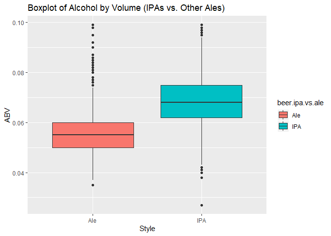

IPA Beer Comparisons to Other Ale Beers
================
Chance Robinson
10/21/2019

  - [Exploratory Data Analysis](#exploratory-data-analysis)
      - [Library Imports](#library-imports)
      - [Load the csv data](#load-the-csv-data)
      - [Default Output](#default-output)
          - [Beers](#beers)
          - [Breweries](#breweries)
      - [Clone data sets](#clone-data-sets)
          - [Beers](#beers-1)
          - [Breweries](#breweries-1)
      - [State Lookup](#state-lookup)
      - [Brewery Count by State](#brewery-count-by-state)
      - [Loop for many k and one training / test
        partition](#loop-for-many-k-and-one-training-test-partition)
      - [Loop for many k and many training / test
        partitions](#loop-for-many-k-and-many-training-test-partitions)

# Exploratory Data Analysis

## Library Imports

``` r
library(tidyverse)
```

    ## -- Attaching packages ----------------------------------------------------------------------------------------------------------------- tidyverse 1.2.1 --

    ## v ggplot2 3.2.0     v purrr   0.3.2
    ## v tibble  2.1.3     v dplyr   0.8.3
    ## v tidyr   0.8.3     v stringr 1.4.0
    ## v readr   1.3.1     v forcats 0.4.0

    ## -- Conflicts -------------------------------------------------------------------------------------------------------------------- tidyverse_conflicts() --
    ## x dplyr::filter() masks stats::filter()
    ## x dplyr::lag()    masks stats::lag()

``` r
library(knitr)
library(kableExtra)
```

    ## 
    ## Attaching package: 'kableExtra'

    ## The following object is masked from 'package:dplyr':
    ## 
    ##     group_rows

## Load the csv data

``` r
beers <- read.csv("../../../data/Beers.csv", stringsAsFactors=FALSE)
breweries <- read.csv("../../../data/Breweries.csv", stringsAsFactors=FALSE)
```

## Default Output

### Beers

``` r
head(beers)
```

    ##                  Name Beer_ID   ABV IBU Brewery_id
    ## 1            Pub Beer    1436 0.050  NA        409
    ## 2         Devil's Cup    2265 0.066  NA        178
    ## 3 Rise of the Phoenix    2264 0.071  NA        178
    ## 4            Sinister    2263 0.090  NA        178
    ## 5       Sex and Candy    2262 0.075  NA        178
    ## 6        Black Exodus    2261 0.077  NA        178
    ##                            Style Ounces
    ## 1            American Pale Lager     12
    ## 2        American Pale Ale (APA)     12
    ## 3                   American IPA     12
    ## 4 American Double / Imperial IPA     12
    ## 5                   American IPA     12
    ## 6                  Oatmeal Stout     12

``` r
# summary(beers)
# str(beers)
```

### Breweries

``` r
head(breweries)
```

    ##   Brew_ID                      Name          City State
    ## 1       1        NorthGate Brewing    Minneapolis    MN
    ## 2       2 Against the Grain Brewery    Louisville    KY
    ## 3       3  Jack's Abby Craft Lagers    Framingham    MA
    ## 4       4 Mike Hess Brewing Company     San Diego    CA
    ## 5       5   Fort Point Beer Company San Francisco    CA
    ## 6       6     COAST Brewing Company    Charleston    SC

``` r
# summary(breweries)
# str(breweries)
```

## Clone data sets

  - Create a pristine copy of the originals so that further refinements
    of the columns names, values, etc.. can be performed

### Beers

``` r
df_beers <- beers
colnames(df_beers)
```

    ## [1] "Name"       "Beer_ID"    "ABV"        "IBU"        "Brewery_id"
    ## [6] "Style"      "Ounces"

``` r
names(df_beers) <- c("beer.name", "beer.id", "beer.abv", "beer.ibu", "beer.brewery.id", "beer.style", "beer.ounces")
head(df_beers)
```

    ##             beer.name beer.id beer.abv beer.ibu beer.brewery.id
    ## 1            Pub Beer    1436    0.050       NA             409
    ## 2         Devil's Cup    2265    0.066       NA             178
    ## 3 Rise of the Phoenix    2264    0.071       NA             178
    ## 4            Sinister    2263    0.090       NA             178
    ## 5       Sex and Candy    2262    0.075       NA             178
    ## 6        Black Exodus    2261    0.077       NA             178
    ##                       beer.style beer.ounces
    ## 1            American Pale Lager          12
    ## 2        American Pale Ale (APA)          12
    ## 3                   American IPA          12
    ## 4 American Double / Imperial IPA          12
    ## 5                   American IPA          12
    ## 6                  Oatmeal Stout          12

### Breweries

``` r
df_breweries <- breweries
colnames(df_breweries)
```

    ## [1] "Brew_ID" "Name"    "City"    "State"

``` r
names(df_breweries) <- c("brewery.id", "brewery.name", "brewery.city", "brewery.state.abb")

# The state column has an extra white space at the end of the string
df_breweries <- df_breweries %>%
  mutate(brewery.state.abb = trimws(brewery.state.abb))

head(df_breweries)
```

    ##   brewery.id              brewery.name  brewery.city brewery.state.abb
    ## 1          1        NorthGate Brewing    Minneapolis                MN
    ## 2          2 Against the Grain Brewery    Louisville                KY
    ## 3          3  Jack's Abby Craft Lagers    Framingham                MA
    ## 4          4 Mike Hess Brewing Company     San Diego                CA
    ## 5          5   Fort Point Beer Company San Francisco                CA
    ## 6          6     COAST Brewing Company    Charleston                SC

## State Lookup

  - Washington D.C. added as an entry

<!-- end list -->

``` r
#makes a data frame with State abbreviation, name  and region
df_state_lookup = data.frame(state.abb, state.name, state.region, state.x77, stringsAsFactors=FALSE) 
# df_state_lookup

# add the District of Columbia as a lookup value
df_state_lookup <- rbind(df_state_lookup, 'DC' = c("DC", "Washington D.C.", "South"))

head(df_state_lookup[1:5])
```

    ##            state.abb state.name state.region Population Income
    ## Alabama           AL    Alabama        South       3615   3624
    ## Alaska            AK     Alaska         West        365   6315
    ## Arizona           AZ    Arizona         West       2212   4530
    ## Arkansas          AR   Arkansas        South       2110   3378
    ## California        CA California         West      21198   5114
    ## Colorado          CO   Colorado         West       2541   4884

## Brewery Count by State

1.  How many breweries are present in each state?

<!-- end list -->

  - Note that all 50 states have counts and that the District of
    Columbia is also included to make a total of
51

<!-- end list -->

``` r
df_breweries_state <- merge(df_breweries, df_state_lookup[1:5], by.x = "brewery.state.abb", by.y = "state.abb", all.x = TRUE)

head(df_breweries_state)
```

    ##   brewery.state.abb brewery.id                  brewery.name brewery.city
    ## 1                AK        494  Broken Tooth Brewing Company    Anchorage
    ## 2                AK        224  Midnight Sun Brewing Company    Anchorage
    ## 3                AK        459   Kenai River Brewing Company     Soldotna
    ## 4                AK        271       Alaskan Brewing Company       Juneau
    ## 5                AK        454        Denali Brewing Company    Talkeetna
    ## 6                AK        558 Sleeping Lady Brewing Company    Anchorage
    ##   state.name state.region Population Income
    ## 1     Alaska         West        365   6315
    ## 2     Alaska         West        365   6315
    ## 3     Alaska         West        365   6315
    ## 4     Alaska         West        365   6315
    ## 5     Alaska         West        365   6315
    ## 6     Alaska         West        365   6315

``` r
df_merged <- merge(df_beers, df_breweries_state, by.x = "beer.brewery.id", by.y = "brewery.id")
head(df_merged)
```

    ##   beer.brewery.id     beer.name beer.id beer.abv beer.ibu
    ## 1               1  Get Together    2692    0.045       50
    ## 2               1 Maggie's Leap    2691    0.049       26
    ## 3               1    Wall's End    2690    0.048       19
    ## 4               1       Pumpion    2689    0.060       38
    ## 5               1    Stronghold    2688    0.060       25
    ## 6               1   Parapet ESB    2687    0.056       47
    ##                            beer.style beer.ounces brewery.state.abb
    ## 1                        American IPA          16                MN
    ## 2                  Milk / Sweet Stout          16                MN
    ## 3                   English Brown Ale          16                MN
    ## 4                         Pumpkin Ale          16                MN
    ## 5                     American Porter          16                MN
    ## 6 Extra Special / Strong Bitter (ESB)          16                MN
    ##         brewery.name brewery.city state.name  state.region Population
    ## 1 NorthGate Brewing   Minneapolis  Minnesota North Central       3921
    ## 2 NorthGate Brewing   Minneapolis  Minnesota North Central       3921
    ## 3 NorthGate Brewing   Minneapolis  Minnesota North Central       3921
    ## 4 NorthGate Brewing   Minneapolis  Minnesota North Central       3921
    ## 5 NorthGate Brewing   Minneapolis  Minnesota North Central       3921
    ## 6 NorthGate Brewing   Minneapolis  Minnesota North Central       3921
    ##   Income
    ## 1   4675
    ## 2   4675
    ## 3   4675
    ## 4   4675
    ## 5   4675
    ## 6   4675

``` r
df_merged$beer.ipa.vs.ale <- ''

head(df_merged)
```

    ##   beer.brewery.id     beer.name beer.id beer.abv beer.ibu
    ## 1               1  Get Together    2692    0.045       50
    ## 2               1 Maggie's Leap    2691    0.049       26
    ## 3               1    Wall's End    2690    0.048       19
    ## 4               1       Pumpion    2689    0.060       38
    ## 5               1    Stronghold    2688    0.060       25
    ## 6               1   Parapet ESB    2687    0.056       47
    ##                            beer.style beer.ounces brewery.state.abb
    ## 1                        American IPA          16                MN
    ## 2                  Milk / Sweet Stout          16                MN
    ## 3                   English Brown Ale          16                MN
    ## 4                         Pumpkin Ale          16                MN
    ## 5                     American Porter          16                MN
    ## 6 Extra Special / Strong Bitter (ESB)          16                MN
    ##         brewery.name brewery.city state.name  state.region Population
    ## 1 NorthGate Brewing   Minneapolis  Minnesota North Central       3921
    ## 2 NorthGate Brewing   Minneapolis  Minnesota North Central       3921
    ## 3 NorthGate Brewing   Minneapolis  Minnesota North Central       3921
    ## 4 NorthGate Brewing   Minneapolis  Minnesota North Central       3921
    ## 5 NorthGate Brewing   Minneapolis  Minnesota North Central       3921
    ## 6 NorthGate Brewing   Minneapolis  Minnesota North Central       3921
    ##   Income beer.ipa.vs.ale
    ## 1   4675                
    ## 2   4675                
    ## 3   4675                
    ## 4   4675                
    ## 5   4675                
    ## 6   4675

``` r
df_merged %>%
  count(beer.style)
```

    ## # A tibble: 100 x 2
    ##    beer.style                     n
    ##    <chr>                      <int>
    ##  1 ""                             5
    ##  2 Abbey Single Ale               2
    ##  3 Altbier                       13
    ##  4 American Adjunct Lager        18
    ##  5 American Amber / Red Ale     133
    ##  6 American Amber / Red Lager    29
    ##  7 American Barleywine            3
    ##  8 American Black Ale            36
    ##  9 American Blonde Ale          108
    ## 10 American Brown Ale            70
    ## # ... with 90 more rows

``` r
df_merged %>%
  filter(beer.style == '')
```

    ##   beer.brewery.id                      beer.name beer.id beer.abv beer.ibu
    ## 1              30                Special Release    2210       NA       NA
    ## 2              67                  OktoberFiesta    2527    0.053       27
    ## 3             161 Kilt Lifter Scottish-Style Ale    1635    0.060       21
    ## 4             167                 The CROWLERâ„¢    1796       NA       NA
    ## 5             167           CAN'D AID Foundation    1790       NA       NA
    ##   beer.style beer.ounces brewery.state.abb               brewery.name
    ## 1                     16                TX        Cedar Creek Brewery
    ## 2                     12                TX   Freetail Brewing Company
    ## 3                     12                AZ Four Peaks Brewing Company
    ## 4                     32                CO        Oskar Blues Brewery
    ## 5                     12                CO        Oskar Blues Brewery
    ##   brewery.city state.name state.region Population Income beer.ipa.vs.ale
    ## 1 Seven Points      Texas        South      12237   4188                
    ## 2  San Antonio      Texas        South      12237   4188                
    ## 3        Tempe    Arizona         West       2212   4530                
    ## 4     Longmont   Colorado         West       2541   4884                
    ## 5     Longmont   Colorado         West       2541   4884

``` r
df_merged %>%
  filter(beer.style %in% c("American Double / Imperial IPA", "American IPA", "Belgian IPA", "English India Pale Ale (IPA)")) %>%
  count(beer.style)
```

    ## # A tibble: 4 x 2
    ##   beer.style                         n
    ##   <chr>                          <int>
    ## 1 American Double / Imperial IPA   105
    ## 2 American IPA                     424
    ## 3 Belgian IPA                       18
    ## 4 English India Pale Ale (IPA)      13

``` r
df_ipa <- df_merged %>%
  filter(beer.style %in% c("American Double / Imperial IPA", "American IPA", "Belgian IPA", "English India Pale Ale (IPA)")) %>%
  mutate(beer.ipa.vs.ale = 'IPA')


head(df_ipa)
```

    ##   beer.brewery.id      beer.name beer.id beer.abv beer.ibu
    ## 1               1   Get Together    2692    0.045       50
    ## 2               2 Citra Ass Down    2686    0.080       68
    ## 3               2    Rico Sauvin    2678    0.076       68
    ## 4               2   Pile of Face    2675    0.060       65
    ## 5               4 Habitus (2014)    2668    0.080      100
    ## 6               4          Solis    2667    0.075       85
    ##                       beer.style beer.ounces brewery.state.abb
    ## 1                   American IPA          16                MN
    ## 2 American Double / Imperial IPA          16                KY
    ## 3 American Double / Imperial IPA          16                KY
    ## 4                   American IPA          16                KY
    ## 5 American Double / Imperial IPA          16                CA
    ## 6                   American IPA          16                CA
    ##                brewery.name brewery.city state.name  state.region
    ## 1        NorthGate Brewing   Minneapolis  Minnesota North Central
    ## 2 Against the Grain Brewery   Louisville   Kentucky         South
    ## 3 Against the Grain Brewery   Louisville   Kentucky         South
    ## 4 Against the Grain Brewery   Louisville   Kentucky         South
    ## 5 Mike Hess Brewing Company    San Diego California          West
    ## 6 Mike Hess Brewing Company    San Diego California          West
    ##   Population Income beer.ipa.vs.ale
    ## 1       3921   4675             IPA
    ## 2       3387   3712             IPA
    ## 3       3387   3712             IPA
    ## 4       3387   3712             IPA
    ## 5      21198   5114             IPA
    ## 6      21198   5114             IPA

``` r
# Kilt Lifter Scottish-Style Ale (1635)
df_merged[946,]
```

    ##     beer.brewery.id                      beer.name beer.id beer.abv
    ## 946             161 Kilt Lifter Scottish-Style Ale    1635     0.06
    ##     beer.ibu beer.style beer.ounces brewery.state.abb
    ## 946       21                     12                AZ
    ##                   brewery.name brewery.city state.name state.region
    ## 946 Four Peaks Brewing Company        Tempe    Arizona         West
    ##     Population Income beer.ipa.vs.ale
    ## 946       2212   4530

``` r
df_merged %>%
  filter(!beer.style %in% c("American Double / Imperial IPA", "American IPA", "Belgian IPA", "English India Pale Ale (IPA)")) %>%
  filter(str_detect(beer.style, "Ale") | beer.id==1635) %>%
  count(beer.style)
```

    ## # A tibble: 29 x 2
    ##    beer.style                   n
    ##    <chr>                    <int>
    ##  1 ""                           1
    ##  2 Abbey Single Ale             2
    ##  3 American Amber / Red Ale   133
    ##  4 American Black Ale          36
    ##  5 American Blonde Ale        108
    ##  6 American Brown Ale          70
    ##  7 American Dark Wheat Ale      7
    ##  8 American Pale Ale (APA)    245
    ##  9 American Pale Wheat Ale     97
    ## 10 American Strong Ale         14
    ## # ... with 19 more rows

``` r
df_ale <- df_merged %>%
  filter(!beer.style %in% c("American Double / Imperial IPA", "American IPA", "Belgian IPA", "English India Pale Ale (IPA)")) %>%
  filter(str_detect(beer.style, "Ale") | beer.id==1635) %>%
  mutate(beer.ipa.vs.ale = 'Ale')

head(df_ale)
```

    ##   beer.brewery.id        beer.name beer.id beer.abv beer.ibu
    ## 1               1       Wall's End    2690    0.048       19
    ## 2               1          Pumpion    2689    0.060       38
    ## 3               2           A Beer    2683    0.042       42
    ## 4               2    Flesh Gourd'n    2681    0.066       21
    ## 5               2         Sho'nuff    2680    0.040       13
    ## 6               2 Coq de la Marche    2677    0.051       38
    ##                beer.style beer.ounces brewery.state.abb
    ## 1       English Brown Ale          16                MN
    ## 2             Pumpkin Ale          16                MN
    ## 3 American Pale Ale (APA)          16                KY
    ## 4             Pumpkin Ale          16                KY
    ## 5        Belgian Pale Ale          16                KY
    ## 6  Saison / Farmhouse Ale          16                KY
    ##                brewery.name brewery.city state.name  state.region
    ## 1        NorthGate Brewing   Minneapolis  Minnesota North Central
    ## 2        NorthGate Brewing   Minneapolis  Minnesota North Central
    ## 3 Against the Grain Brewery   Louisville   Kentucky         South
    ## 4 Against the Grain Brewery   Louisville   Kentucky         South
    ## 5 Against the Grain Brewery   Louisville   Kentucky         South
    ## 6 Against the Grain Brewery   Louisville   Kentucky         South
    ##   Population Income beer.ipa.vs.ale
    ## 1       3921   4675             Ale
    ## 2       3921   4675             Ale
    ## 3       3387   3712             Ale
    ## 4       3387   3712             Ale
    ## 5       3387   3712             Ale
    ## 6       3387   3712             Ale

``` r
# df_merged <- as.factor(df_merged$beer.ipa.vs.ale)
# 
head(df_merged)
```

    ##   beer.brewery.id     beer.name beer.id beer.abv beer.ibu
    ## 1               1  Get Together    2692    0.045       50
    ## 2               1 Maggie's Leap    2691    0.049       26
    ## 3               1    Wall's End    2690    0.048       19
    ## 4               1       Pumpion    2689    0.060       38
    ## 5               1    Stronghold    2688    0.060       25
    ## 6               1   Parapet ESB    2687    0.056       47
    ##                            beer.style beer.ounces brewery.state.abb
    ## 1                        American IPA          16                MN
    ## 2                  Milk / Sweet Stout          16                MN
    ## 3                   English Brown Ale          16                MN
    ## 4                         Pumpkin Ale          16                MN
    ## 5                     American Porter          16                MN
    ## 6 Extra Special / Strong Bitter (ESB)          16                MN
    ##         brewery.name brewery.city state.name  state.region Population
    ## 1 NorthGate Brewing   Minneapolis  Minnesota North Central       3921
    ## 2 NorthGate Brewing   Minneapolis  Minnesota North Central       3921
    ## 3 NorthGate Brewing   Minneapolis  Minnesota North Central       3921
    ## 4 NorthGate Brewing   Minneapolis  Minnesota North Central       3921
    ## 5 NorthGate Brewing   Minneapolis  Minnesota North Central       3921
    ## 6 NorthGate Brewing   Minneapolis  Minnesota North Central       3921
    ##   Income beer.ipa.vs.ale
    ## 1   4675                
    ## 2   4675                
    ## 3   4675                
    ## 4   4675                
    ## 5   4675                
    ## 6   4675

``` r
head(df_merged) %>%
  mutate(beer.style.words = as.character(str_split(beer.style, boundary("word")))) %>%
  select(beer.style.words)
```

    ##                                   beer.style.words
    ## 1                             c("American", "IPA")
    ## 2                      c("Milk", "Sweet", "Stout")
    ## 3                     c("English", "Brown", "Ale")
    ## 4                              c("Pumpkin", "Ale")
    ## 5                          c("American", "Porter")
    ## 6 c("Extra", "Special", "Strong", "Bitter", "ESB")

``` r
# str_split(df_merged$beer.style, boundary("word"))
```

``` r
# Ale

# India Pale Ale
IPA <- c("American Double / Imperial IPA", "American IPA", "Belgian IPA", "English India Pale Ale (IPA)")
```

``` r
df_merged %>%
  filter(beer.style %in% c("American Pale Ale (APA)")) %>%
  filter(!is.na(beer.abv)) %>%
  summarize(beers.abv.mean = mean(beer.abv), 
            beers.abv.median = median(beer.abv), 
            beers.abv.sd = sd(beer.abv), 
            beers.abv.min = min(beer.abv), 
            beers.abv.max = max(beer.abv), 
            count = n()) 
```

    ##   beers.abv.mean beers.abv.median beers.abv.sd beers.abv.min beers.abv.max
    ## 1     0.05457741            0.055  0.006322003         0.037         0.073
    ##   count
    ## 1   239

``` r
df_merged %>%
  filter(beer.style  %in% c("American Double / Imperial IPA", "American IPA", "Belgian IPA", "English India Pale Ale (IPA)")) %>%
  filter(!is.na(beer.abv)) %>%
  summarize(beers.abv.mean = mean(beer.abv), 
            beers.abv.median = median(beer.abv), 
            beers.abv.sd = sd(beer.abv), 
            beers.abv.min = min(beer.abv), 
            beers.abv.max = max(beer.abv), 
            count = n()) 
```

    ##   beers.abv.mean beers.abv.median beers.abv.sd beers.abv.min beers.abv.max
    ## 1     0.06897632            0.068   0.01242222         0.027         0.099
    ##   count
    ## 1   549

``` r
df_merged %>%
  filter(beer.style %in% c("American Pale Ale (APA)")) %>%
  filter(!is.na(beer.ibu)) %>%
  summarize(beers.ibu.mean = mean(beer.ibu), 
            beers.ibu.median = median(beer.ibu), 
            beers.ibu.sd = sd(beer.ibu), 
            beers.ibu.min = min(beer.ibu), 
            beers.ibu.max = max(beer.ibu), 
            count = n()) 
```

    ##   beers.ibu.mean beers.ibu.median beers.ibu.sd beers.ibu.min beers.ibu.max
    ## 1       44.94118               44     11.54296            16            68
    ##   count
    ## 1   153

``` r
df_merged %>%
  filter(!beer.style %in% c("American Double / Imperial IPA", "American IPA", "Belgian IPA", "English India Pale Ale (IPA)")) %>%
  filter(str_detect(beer.style, "Ale")) %>%
  filter(!is.na(beer.ibu)) %>%
  summarize(beers.ibu.mean = mean(beer.ibu), 
            beers.ibu.median = median(beer.ibu), 
            beers.ibu.sd = sd(beer.ibu), 
            beers.ibu.min = min(beer.ibu), 
            beers.ibu.max = max(beer.ibu), 
            count = n()) 
```

    ##   beers.ibu.mean beers.ibu.median beers.ibu.sd beers.ibu.min beers.ibu.max
    ## 1       34.33333               30     17.97471             4           115
    ##   count
    ## 1   552

``` r
total_beers_count <- dim(df_merged)[1]
ipa_count <- dim(df_ipa)[1]
ale_count <- dim(df_ale)[1]

df_combined_ale <- rbind(df_ipa, df_ale)

ipa_ale_count <- dim(df_combined_ale)[1]


head(df_combined_ale)
```

    ##   beer.brewery.id      beer.name beer.id beer.abv beer.ibu
    ## 1               1   Get Together    2692    0.045       50
    ## 2               2 Citra Ass Down    2686    0.080       68
    ## 3               2    Rico Sauvin    2678    0.076       68
    ## 4               2   Pile of Face    2675    0.060       65
    ## 5               4 Habitus (2014)    2668    0.080      100
    ## 6               4          Solis    2667    0.075       85
    ##                       beer.style beer.ounces brewery.state.abb
    ## 1                   American IPA          16                MN
    ## 2 American Double / Imperial IPA          16                KY
    ## 3 American Double / Imperial IPA          16                KY
    ## 4                   American IPA          16                KY
    ## 5 American Double / Imperial IPA          16                CA
    ## 6                   American IPA          16                CA
    ##                brewery.name brewery.city state.name  state.region
    ## 1        NorthGate Brewing   Minneapolis  Minnesota North Central
    ## 2 Against the Grain Brewery   Louisville   Kentucky         South
    ## 3 Against the Grain Brewery   Louisville   Kentucky         South
    ## 4 Against the Grain Brewery   Louisville   Kentucky         South
    ## 5 Mike Hess Brewing Company    San Diego California          West
    ## 6 Mike Hess Brewing Company    San Diego California          West
    ##   Population Income beer.ipa.vs.ale
    ## 1       3921   4675             IPA
    ## 2       3387   3712             IPA
    ## 3       3387   3712             IPA
    ## 4       3387   3712             IPA
    ## 5      21198   5114             IPA
    ## 6      21198   5114             IPA

| Column Name     | Count | % of Total |
| --------------- | ----- | ---------- |
| 1\. IPA         | 560   | 23.2365145 |
| 2\. Other Ales  | 964   | 40         |
| 3\. Ales + IPAs | 1524  | 63.2365145 |

``` r
df_combined_ale %>% 
  filter(!is.na(beer.abv)) %>%
  ggplot(aes(x = beer.ipa.vs.ale, y = beer.abv, fill = beer.ipa.vs.ale)) + 
  geom_boxplot() + 
  ggtitle("Boxplot of Alcohol by Volume (IPAs vs. Other Ales)") + 
  xlab("Style") + 
  ylab("ABV")
```

<!-- -->

``` r
df_combined_ale %>% 
  filter(!is.na(beer.ibu)) %>%
  ggplot(aes(x = beer.ipa.vs.ale, y = beer.ibu, fill = beer.ipa.vs.ale)) + 
  geom_boxplot() + 
  ggtitle("Boxplot of Int. Bitterness Units (IPAs vs. Other Ales)") + 
  xlab("Style") + 
  ylab("IBU")
```

<!-- -->

``` r
library(class)
library(caret)
```

    ## Loading required package: lattice

    ## 
    ## Attaching package: 'caret'

    ## The following object is masked from 'package:purrr':
    ## 
    ##     lift

``` r
library(e1071)
```

``` r
df_classify <- df_combined_ale %>% 
  filter(!is.na(beer.abv) & !is.na(beer.ibu))

df_classify %>%
  group_by(beer.ipa.vs.ale) %>%
  summarize(beers.abv.median = median(beer.abv), beers.ibu.median = median(beer.ibu), count = n())
```

    ## # A tibble: 2 x 4
    ##   beer.ipa.vs.ale beers.abv.median beers.ibu.median count
    ##   <chr>                      <dbl>            <dbl> <int>
    ## 1 Ale                       0.054                30   553
    ## 2 IPA                       0.0685               70   386

``` r
df_classify %>% 
  ggplot(aes(x = beer.abv, y = beer.ibu, color =  beer.ipa.vs.ale)) + 
  xlab("ABV") + ylab("IBU") + 
  geom_point()
```

<!-- -->

``` r
# df = data.frame(beer.abv = .07, beer.ibu = 50 )
# knn(df_combined_ale_cleaned[,c(4,5)], df, df_combined_ale_cleaned$beer.ipa.vs.ale, k = 5, prob = TRUE)
```

``` r
set.seed(1234)
split.perc = .70

# summary(df_classify)


# standardize values
df_classify$z.abv = scale(df_classify$beer.abv)
df_classify$z.ibu = scale(df_classify$beer.ibu)


train.indices = sample(1:dim(df_classify)[1],round(split.perc * dim(df_classify)[1]))

train = df_classify[train.indices,]
test = df_classify[-train.indices,]

dim(df_classify) # 939
```

    ## [1] 939  17

``` r
dim(train) # 657
```

    ## [1] 657  17

``` r
dim(test) #282
```

    ## [1] 282  17

``` r
# original scale
classifications = knn(train[,c(4,5)],test[,c(4,5)], train$beer.ipa.vs.ale, prob = TRUE, k = 6)
# confusionMatrix(table(test$beer.ipa.vs.ale,classifications))

# standardized
classifications = knn(train[,c(16,17)],test[,c(16,17)], train$beer.ipa.vs.ale, prob = TRUE, k = 16)
confusionMatrix(table(test$beer.ipa.vs.ale,classifications))
```

    ## Confusion Matrix and Statistics
    ## 
    ##      classifications
    ##       Ale IPA
    ##   Ale 146  18
    ##   IPA  16 102
    ##                                          
    ##                Accuracy : 0.8794         
    ##                  95% CI : (0.8356, 0.915)
    ##     No Information Rate : 0.5745         
    ##     P-Value [Acc > NIR] : <2e-16         
    ##                                          
    ##                   Kappa : 0.7529         
    ##                                          
    ##  Mcnemar's Test P-Value : 0.8638         
    ##                                          
    ##             Sensitivity : 0.9012         
    ##             Specificity : 0.8500         
    ##          Pos Pred Value : 0.8902         
    ##          Neg Pred Value : 0.8644         
    ##              Prevalence : 0.5745         
    ##          Detection Rate : 0.5177         
    ##    Detection Prevalence : 0.5816         
    ##       Balanced Accuracy : 0.8756         
    ##                                          
    ##        'Positive' Class : Ale            
    ## 

## Loop for many k and one training / test partition

``` r
acc = data.frame(accuracy = numeric(30), k = numeric(30))

for(i in 1:30)
{
  classifications = knn(train[,c(16,17)],test[,c(16,17)], train$beer.ipa.vs.ale, prob = TRUE, k = i)
  table(test$beer.ipa.vs.ale, classifications)
  CM = confusionMatrix(table(test$beer.ipa.vs.ale,classifications))
  acc$accuracy[i] = CM$overall[1]
  acc$k[i] = i
}

plot(acc$k,acc$accuracy, type = "l", xlab = "k", ylab="accuracy")
```

<!-- -->

## Loop for many k and many training / test partitions

``` r
set.seed(1234)
iterations = 100
numks = 30


masterAcc = matrix(nrow = iterations, ncol = numks)

for(j in 1:iterations)
{
  train.indices = sample(1:dim(df_classify)[1],round(split.perc * dim(df_classify)[1]))
  train = df_classify[train.indices,]
  test = df_classify[-train.indices,]
  for(i in 1:numks)
  {
    classifications = knn(train[,c(16,17)],test[,c(16,17)], train$beer.ipa.vs.ale, prob = TRUE, k = i)
    table(test$beer.ipa.vs.ale, classifications)
    CM = confusionMatrix(table(test$beer.ipa.vs.ale,classifications))
    masterAcc[j,i] = CM$overall[1]
  }
  
}

MeanAcc = colMeans(masterAcc)

plot(seq(1,numks,1),MeanAcc, type = "l")
```

<!-- -->

``` r
which.max(MeanAcc)
```

    ## [1] 17

``` r
max(MeanAcc)
```

    ## [1] 0.8685461
